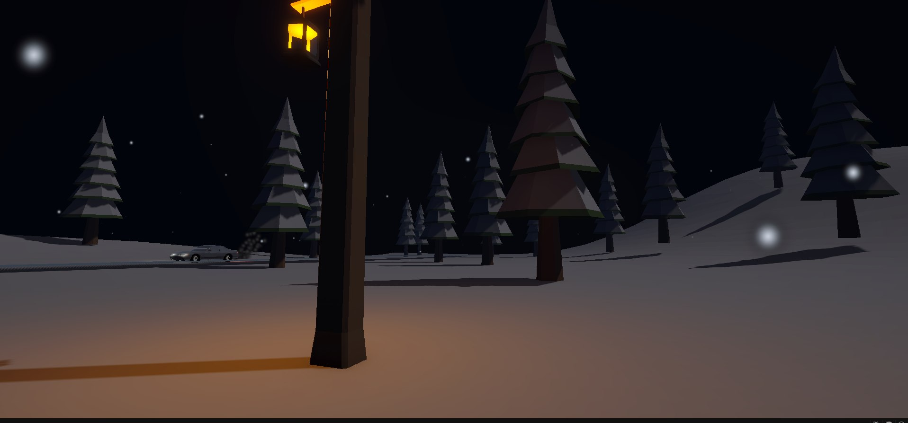
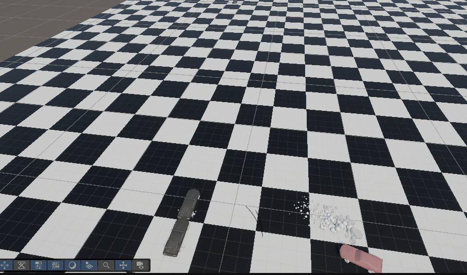

# TestTask11.08

# Тестовое задание — Unity

## Общая информация

В рамках тестового задания были выполнены обе поставленные задачи:

- **Тест 1 — сцена леса с дорогой**
- **Тест 2 — сетчатая дорога и трафик**

Все основные требования из технического задания реализованы и проверены непосредственно в Unity.

> Архитектура проекта специально не усложнялась, так как в задании не были указаны требования к конкретной архитектуре, паттернам проектирования или структуре кода. При необходимости проект можно дополнительно переработать под требуемую архитектуру без изменения основной логики.

---

# Тест 1 — Сцена леса с дорогой

## Описание

Создана отдельная небольшая сцена леса с автомобильной дорогой.

Сцена выполнена в зимней стилистике с заснеженным окружением.

В сцене присутствуют:

- автомобильная дорога;
- лесное окружение;
- деревья;
- кусты;
- пеньки;
- элементы окружения вдоль дороги;
- автомобиль;
- освещение и визуальное оформление сцены.

Размер сцены специально оставлен небольшим, чтобы она соответствовала требованиям тестового задания и при этом создавала полноценное ощущение лесной трассы.

## Реализовано

- [x] Лесная сцена
- [x] Зимнее / заснеженное окружение
- [x] Автомобильная дорога
- [x] Деревья
- [x] Кусты
- [x] Пеньки и дополнительные элементы окружения
- [x] Автомобиль
- [x] Оформление окружения вдоль дороги
- [x] Настроенное освещение

## Результат

Сцена полностью собрана в Unity и соответствует поставленной задаче: небольшая лесная трасса с окружением и автомобилем.

**Ссылка на выполнение:**  
`ВСТАВИТЬ_ССЫЛКУ_НА_ПРОЕКТ_ИЛИ_БИЛД`

---

# Тест 2 — Сетчатая дорога и трафик

## Описание

Создана отдельная сцена с автомобильной дорогой, выполненной в виде сетчатой структуры.

На дороге одновременно находятся **4 автомобиля**:

- 3 автомобиля управляются компьютером;
- 1 автомобиль управляется игроком.

Для автомобилей реализовано автоматическое движение и переключение управления.

## Управление

### Управление автомобилем игроком

Используются стандартные клавиши:

| Клавиша | Действие |
|---|---|
| `W` | Движение вперёд |
| `S` | Движение назад |
| `A` | Поворот налево |
| `D` | Поворот направо |
| `Space` | Переключение автопилота |

## Автопилот

Для автомобилей реализован алгоритм автоматического управления.

Автомобиль под управлением компьютера самостоятельно:

- двигается;
- меняет направление;
- выполняет случайные действия;
- продолжает движение без участия игрока;
- ограничен границами дороги.

Автопилот можно включать и отключать.

При включении автомобиль передаётся под управление алгоритма.

При отключении управление возвращается игроку.

## Перехват управления автомобилем

Реализована механика передачи управления между автомобилями.

При клике по автомобилю, которым управляет компьютер:

1. выбранный автомобиль становится автомобилем игрока;
2. управление игроком переключается на выбранный автомобиль;
3. предыдущий автомобиль игрока становится управляемым компьютером;
4. количество автомобилей в трафике остаётся неизменным;
5. система продолжает работать без необходимости вручную перенастраивать автомобили.

Таким образом, игрок может в любой момент выбрать другой автомобиль из трафика и продолжить управление уже им.

## Границы дороги

Чтобы автомобили не могли покинуть игровую область, по краям сетчатой дороги созданы физические ограничители.

Они имеют `Collider` и предотвращают выезд автомобиля за пределы игровой зоны.

## Реализовано

- [x] Сетчатая автомобильная дорога
- [x] 4 автомобиля
- [x] 3 автомобиля под управлением компьютера
- [x] 1 автомобиль под управлением игрока
- [x] Автоматическое управление автомобилями
- [x] Переключение управления по клику на автомобиль
- [x] Предыдущий автомобиль игрока становится AI-автомобилем
- [x] Возможность переключения между автомобилями
- [x] Управление `WASD`
- [x] Переключение автопилота
- [x] Ограничение игровой зоны
- [x] Физические коллайдеры границ

## Результат

Все основные требования второго тестового задания реализованы и работают в Unity.

**Ссылка на выполнение:**  
`ВСТАВИТЬ_ССЫЛКУ_НА_ПРОЕКТ_ИЛИ_БИЛД`

---

# Техническая часть

Проект реализован на **Unity / C#**.

Основная логика разделена на отдельные компоненты по функциональному назначению:

- управление автомобилем;
- автопилот;
- переключение управления;
- камеры;
- генерация дороги / окружения;
- физические ограничения игровой зоны.

При этом **конкретная архитектура или использование определённых паттернов проектирования в тестовом задании не требовались**, поэтому проект не усложнялся дополнительными архитектурными абстракциями.

При необходимости существующую реализацию можно переработать, например, под:

- более строгую компонентную архитектуру;
- State Machine для состояний автомобиля;
- отдельный AI-контроллер;
- систему дорожных узлов;
- систему управления трафиком;
- событийную систему переключения управления.

Однако для выполнения поставленного ТЗ это не являлось обязательным условием.

---

# Итог

Оба тестовых задания выполнены в соответствии с предоставленной схемой и требованиями:

### Тест 1

**Лес + зимнее окружение + автомобильная дорога + элементы окружения.**

### Тест 2

**Сетчатая дорога + 4 автомобиля + AI-трафик + управление игроком + переключение управления между автомобилями.**

Все основные сценарии из задания реализованы и проверены.

**Проект / Build:**  
`ВСТАВИТЬ_ССЫЛКУ`

**Видео демонстрации:**  
`ВСТАВИТЬ_ССЫЛКУ`

---

## Примечание

Реализация выполнена именно в соответствии с поставленным техническим заданием. Дополнительные архитектурные требования, паттерны проектирования или ограничения по структуре проекта в ТЗ отсутствовали, поэтому они намеренно не вводились без необходимости.

**Функциональная часть задания выполнена полностью.**

## Скриншоты 

